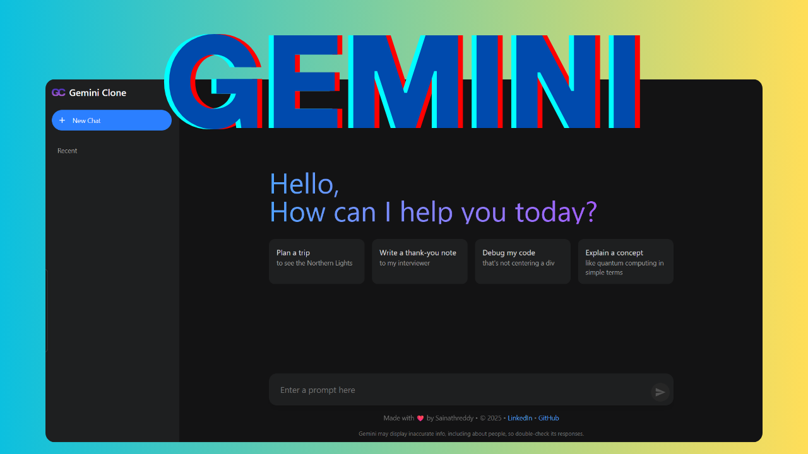

# 🤖 Gem- **🤖 AI-Powered Chat**: Integrated with Google's GenAI API for intelligent conversations

A modern, responsive web application that replicates the Google Gemini AI interface, built with React and Vite. This project provides a clean, intuitive chat interface powered by Google's Generative AI API.



## ✨ Features

- **🤖 AI-Powered Chat**: Integrated with Google's GenAI API for intelligent conversations
- **💬 Real-time Messaging**: Instant responses with loading states and error handling
- **📝 Markdown Support**: Full markdown rendering with GitHub Flavored Markdown
- **📱 Responsive Design**: Beautiful, modern UI that works on desktop and mobile devices
- **🔄 Chat History**: Sidebar with easy access to chat history
- **🎨 Modern Interface**: Clean, intuitive design inspired by Google's Gemini interface
- **⚡ Fast Performance**: Built with Vite and React 19 for optimal performance
- **🎯 TypeScript**: Full TypeScript support for better development experience

## 🚀 Quick Start

### Prerequisites

- Node.js (version 18 or higher)
- npm or yarn package manager
- Google Gemini API key

### Installation

1. **Clone the repository**

   ```bash
   git clone https://github.com/sainath-666/gemini-clone.git
   cd gemini-clone
   ```

2. **Install dependencies**

   ```bash
   npm install
   ```

3. **Set up your API key**

   Create a `.env` file in the root directory:

   ```env
   VITE_GEMINI_API=your_gemini_api_key_here
   ```

   To get your API key:

   - Visit [Google AI Studio](https://makersuite.google.com/app/apikey)
   - Create a new API key
   - Copy the key to your `.env` file

4. **Start the development server**

   ```bash
   npm run dev
   ```

5. **Open your browser**

   Navigate to `http://localhost:5173` to see the application running.

## 🛠️ Available Scripts

- `npm run dev` - Start development server
- `npm run build` - Build for production
- `npm run preview` - Preview production build
- `npm run lint` - Run ESLint for code quality

## 📁 Project Structure

```
src/
├── components/           # React components
│   ├── ChatView.tsx     # Main chat interface
│   ├── icons.tsx        # Icon components
│   ├── Message.tsx      # Individual message component
│   ├── PromptInput.tsx  # User input component
│   ├── Sidebar.tsx      # Chat history sidebar
│   └── WelcomeView.tsx  # Welcome screen component
├── services/            # External services
│   └── geminiService.ts # Google GenAI integration
└── styles/             # CSS styles
    └── main.css        # Global styles with Tailwind
```

## 🔧 Configuration

### Development

The application is built with modern web technologies and follows best practices:

- **TypeScript**: Full type safety throughout the application
- **Component Structure**: Modular and reusable React components
- **Styling**: Tailwind CSS for responsive and maintainable styles
- **API Integration**: Google's GenAI SDK for AI interactions
- **Performance**: Vite for fast development and optimized builds

### Environment Variables

| Variable              | Description            | Required |
| --------------------- | ---------------------- | -------- |
| `VITE_GOOGLE_API_KEY` | Your Google AI API key | Yes      |

## Tech Stack

- React 19.1.0
- TypeScript 5.7.2
- Vite 6.2.0
- Tailwind CSS 4.1.11
- @google/genai 1.11.0
- React Markdown 9.0.1

## 🎯 Usage

1. **Start a New Chat**: Click the "New chat" button in the sidebar
2. **Send Messages**: Type your prompt in the input field and press Enter or click the send button
3. **View History**: Expand the sidebar to see your recent conversations
4. **Quick Prompts**: Use the suggested prompt cards for common tasks

## 🎨 UI Components

### Main Interface

- **Greeting Section**: Welcome message with suggested prompts
- **Chat Area**: Real-time conversation display
- **Input Section**: Text input with send, gallery, and microphone buttons

### Sidebar

- **Menu Toggle**: Expandable sidebar navigation
- **New Chat**: Start fresh conversations
- **Recent Chats**: Access previous conversations
- **Settings**: Help, activity, and settings options

## 🔒 Security & Privacy

- API keys are stored in environment variables
- Built-in content safety filters
- No data is stored locally beyond session
- Follows Google's AI safety guidelines

## 🚀 Deployment

### Build for Production

```bash
npm run build
```

The built files will be in the `dist/` directory, ready for deployment to any static hosting service.

### Deploy to Vercel

1. Install Vercel CLI: `npm i -g vercel`
2. Run: `vercel`
3. Add your environment variables in the Vercel dashboard

### Deploy to Netlify

1. Connect your GitHub repository to Netlify
2. Set build command: `npm run build`
3. Set publish directory: `dist`
4. Add environment variables in Netlify dashboard

## 🤝 Contributing

1. Fork the repository
2. Create a feature branch: `git checkout -b feature/amazing-feature`
3. Commit your changes: `git commit -m 'Add amazing feature'`
4. Push to the branch: `git push origin feature/amazing-feature`
5. Open a Pull Request

## 📝 License

This project is licensed under the MIT License - see the [LICENSE](LICENSE) file for details.

## 🙏 Acknowledgments

- [Google Generative AI](https://ai.google.dev/) for the powerful AI capabilities
- [React](https://reactjs.org/) for the amazing framework
- [Vite](https://vitejs.dev/) for the fast build tool
- [Google Gemini](https://gemini.google.com/) for the interface inspiration

## 📞 Support

If you encounter any issues or have questions:

1. Check the [Issues](https://github.com/sainath-666/gemini-clone/issues) page
2. Create a new issue with detailed information
3. Include your Node.js version and any error messages

## 🔄 Changelog

### Version 0.0.0

- Initial release
- Basic chat functionality
- Responsive design
- Google Gemini API integration
- Chat history management

---

**Note**: This is a clone project for educational purposes. Please respect Google's terms of service and API usage guidelines.
